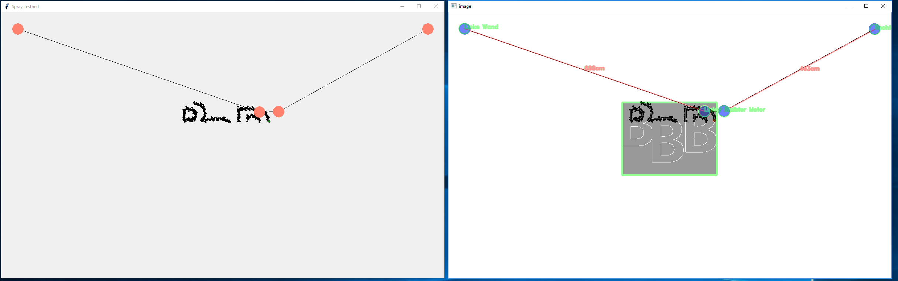
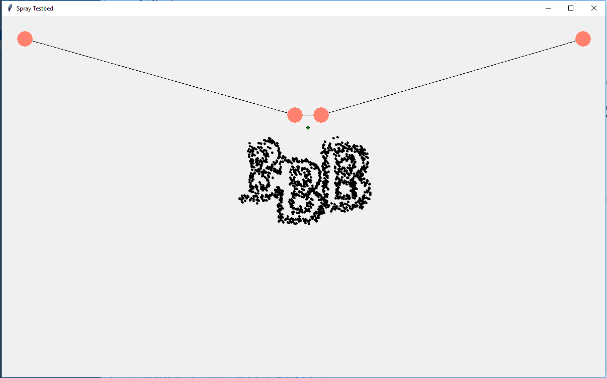
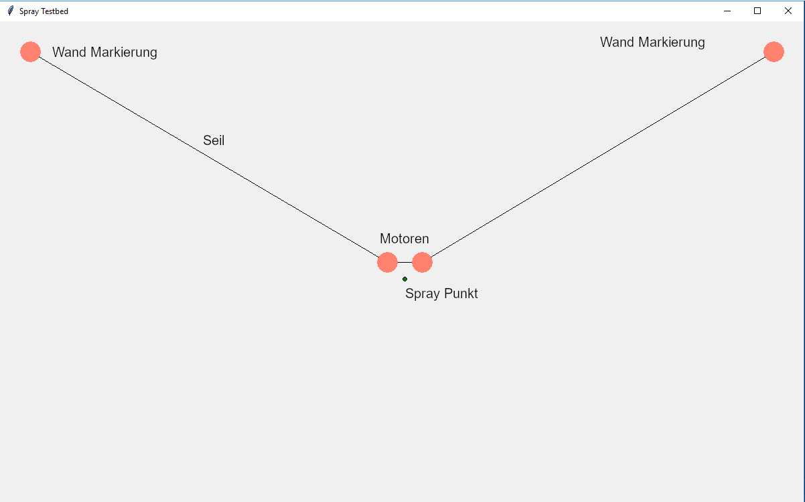

# IDPA Arbeit 2019

### Spraying Simulation Demo

On the left side the simulation is run and on the right side is the controlling programm which has the simulation frames as input.

A finished spray job.

### Visual Explanation Of Simulation

### Getting it to run...
Install all required packages opencv, numpy and pillow.

Run python simulation.py

### Finished Implementation

View a video of the real implementation here.

